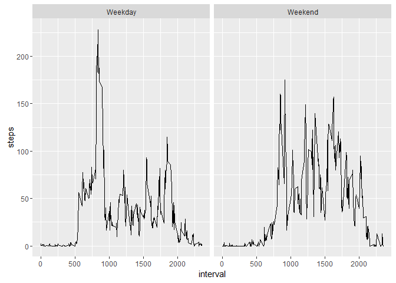

# RR_project1
Caitlin  
September 2016  

##About 
This is the first course project in the Reproducible Research Coursera class from Johns Hopkins University. The purpose of this project was to practice tasks such as loading data, creating plots, and imputing missing data, using activity data collected from a device such as a FitBit. The variables included in this dataset are

- **steps:** the number of steps taken during a five-minute interval, with missing values coded as NA
- **date:** the date on which the measurement was taken, in YYYY-MM-DD format
- **interval:** the five-minute interval during which the measurement was taken  

The dataset is stored in a comma-separated-value (CSV) file and there are a total of 17,568 observations in this dataset.

#Loading and Preprocessing the CSV Data File
Load the CSV file into the data frame `activity`.


```r
activity <- read.csv("C:/Users/Caitlin/Documents/Coursera/repdata%2Fdata%2Factivity/activity.csv")
```

#What is the mean total number of steps taken per day?
Sum the steps taken by day, create a histogram, and calculate the `mean` and `median`.


```r
steps_day_sum <- aggregate(steps ~ date, activity, sum)

hist(steps_day_sum$steps, main="Total Steps per Day", col="red", xlab="Number of Steps")
```

<!-- -->

```r
steps_mean <- mean(steps_day_sum$steps)
steps_median <- median(steps_day_sum$steps)
```

The `mean` is 1.0766189\times 10^{4} and the `median` is 10765.

#What is the average daily activity pattern?
Calculate the average steps per interval, plot the average number of steps per interval, and find the interval with the most average steps.


```r
steps_int_avg <- aggregate(steps ~ interval, activity, mean)

plot(steps_int_avg, type='l',main='Average Steps per Five-Minute Interval',xlab='Interval',ylab='Number of Steps')
```

<!-- -->

```r
max_int <- steps_int_avg[which.max(steps_int_avg$steps),'interval']
```

The interval with the most steps, on average, is 835.

#Imputing Missing Data
Missing data need to imputed, but a complicated approach is not necessary for this assignment. Missing values were imputed by inserting the average for the day in which the missing interval occurred.


```r
total_na <- sum(is.na(activity))

steps_day_avg <- aggregate(steps ~ date, activity, mean)
imputed_activity <- transform(activity, steps = ifelse(is.na(activity$steps), steps_day_avg$steps[match(activity$date,steps_day_avg$date)],activity$steps))
```

Zeroes were imputed for the first day, because all intervals were missing and therefore an average for the day could not be calculated.


```r
imputed_activity[as.character(imputed_activity$date)=='2012-10-01','steps'] <- 0
```

The total number of steps was then recalculated with the imputed data, and a new histogram constructed.


```r
steps_day_sum_i <- aggregate(steps ~ date, imputed_activity, sum)

hist(steps_day_sum_i$steps, main="Total Steps per Day (Imputed)",col="green",xlab="Number of Steps")
```

<!-- -->

The mean and median of the dataset with imputed data were then calculated, as well as the difference between the original and new values.


```r
steps_mean_i <- mean(steps_day_sum_i$steps)
steps_median_i <- median(steps_day_sum_i$steps)
mean_diff <- steps_mean_i - steps_mean
median_diff <- steps_median_i - steps_median
total_diff <- sum(steps_day_sum_i$steps) - sum(steps_day_sum$steps)
```

- The imputed data mean is 1.0566815\times 10^{4}
- The imputed data median is 1.06825\times 10^{4}
- The difference between the imputed and original means is -199.3738644
- The difference between the imputed and original medians is -82.5
- The difference in the total number of steps between the imputed and original data was 0, meaning there were 0 more steps in the imputed data.

#Are there differences in activity between weekdays and weekends?
Create a new factor variable in the dataset with two levels, 'weekday' and 'weekend', and create a panel plot to compare activity levels between the two subsets of data.


```r
library(ggplot2)
```

```
## Warning: package 'ggplot2' was built under R version 3.2.5
```

```r
weekday <- c("Monday", "Tuesday", "Wednesday", "Thursday", "Friday")

imputed_activity$day <- as.factor(ifelse(is.element(weekdays(as.Date(imputed_activity$date)),weekday),"Weekday","Weekend"))

steps_int_avg_i <- aggregate(steps ~ interval + day, imputed_activity, mean)

qplot(interval,steps,data=steps_int_avg_i,facets=.~day,geom="line")
```

<!-- -->

There is a higher peak earlier on weekdays and more activity overall on weekends.
